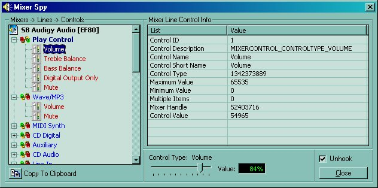

<div align="center">

## MixerSpy


</div>

### Description

Just about everything you want to know about your mixer. I could only represent, with VB and Comctl controls, the mixer controls that my sound card supports which is quite a bit actually. As I don't have a peakmeter, I could not code for that and I haven't yet solved the mystery of multiple item controls. But, just about everything else is there. All of the mixer examples I have seen have been to mimic the intrinsic mixer so I coded mine a little differently so you can see all of the gory details. Enjoy.
 
### More Info
 
Uses mscomctl.ocx (sp4)

Subclassing! This code subclasses SETFOCUS msgs for sound controls (volume, mute, etc) and also subclasses the window for mixer control change messages. You can enable hooking by using the checkbox provided but make sure you disable the hooks before setting breakpoints or hitting the end button. If not, you will freeze the IDE and lose any changes you have made.


<span>             |<span>
---                |---
**Submitted On**   |2004-08-14 20:21:42
**By**             |[AlT](https://github.com/Planet-Source-Code/PSCIndex/blob/master/ByAuthor/alt.md)
**Level**          |Intermediate
**User Rating**    |5.0 (80 globes from 16 users)
**Compatibility**  |VB 6\.0
**Category**       |[Sound/MP3](https://github.com/Planet-Source-Code/PSCIndex/blob/master/ByCategory/sound-mp3__1-45.md)
**World**          |[Visual Basic](https://github.com/Planet-Source-Code/PSCIndex/blob/master/ByWorld/visual-basic.md)
**Archive File**   |[MixerSpy18328512232004\.zip](https://github.com/Planet-Source-Code/alt-mixerspy__1-44556/archive/master.zip)

### API Declarations

```
RtlMoveMemory
GlobalAlloc
GlobalFree
GlobalLock
SetWindowLong
GetWindowLong
CallWindowProc
mixerClose
mixerGetDevCaps
mixerGetID
mixerOpen
mixerGetLineInfo
mixerGetLineControls
mixerGetControlDetails
mixerSetControlDetails
```


